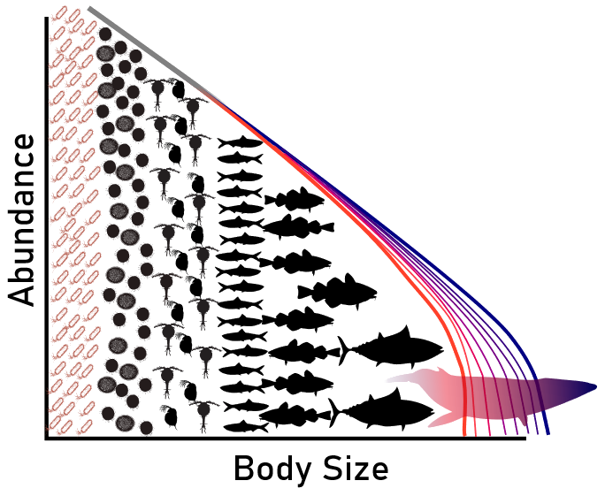

```{r setup, include=FALSE}
knitr::opts_chunk$set(echo = TRUE)
here::i_am("projects/index.Rmd")
```

## Ongoing projects

### Size spectra of North American streams



Organism body size is a critical variable that is associated with numerous ecological attributes of organisms, including metabolic rate, movement, feeding interactions and trophic position, among others. As such, knowing information on the sizes of organisms can tell us a lot about ecosystem patterns and processes. For example, larger organisms use more energy, therefore fewer large individuals can be supported on a fixed energy source than smaller individuals on that same resource. Larger organisms, for the most part, eat individuals smaller then themselves. This project seeks to understand the patterns and drivers of organisms size distributions in streams of North America. We leverage a size-based theory of food webs, size spectra, to understand how energy flows up food webs from small organisms to larger predator species. In this work, we use data from the [National Ecological Observatory Network (NEON)](https://www.neonscience.org/) to explore how environmental variables such as temperature and basal resource availability control the distribution of individual body sizes in an ecosystem.

Relevant papers:

Pomeranz, J., ***J. R. Junker***, V. Gjoni, and J. S. Wesner. (2024). *Maximum likelihood outperforms binning methods for detecting differences in abundance size spectra across environmental gradients*. Journal of Animal Ecology 93:267–280.DOI:<!--- --->10.1111/1365-2656.14044. [PDF](./pdfs/Pomeranz et al. - 2024 - Maximum likelihood outperforms binning methods for.pdf).  [LINK](https://besjournals.onlinelibrary.wiley.com/doi/10.1111/1365-2656.14044).

Wesner, J. S., J. P. F. Pomeranz, ***J. R. Junker***, and V. Gjoni. (2024). *Bayesian hierarchical modelling of size spectra*. Methods in Ecology and Evolution 15:856–867. DOI:<!--- --->10.1111/2041-210X.14312. [PDF](./pdfs/Wesner et al. - 2024 - Bayesian hierarchical modelling of size spectra.pdf). [LINK](https://onlinelibrary.wiley.com/doi/abs/10.1111/2041-210X.14312).

Gjoni, V., J. P. F. Pomeranz, ***J. R. Junker***, and J. S. Wesner. (2024). *Size spectra in freshwater streams are consistent across temperature and resource supply*. bioRxiv. [LINK](https://doi.org/10.1101/2024.01.09.574822).

Gjoni, V., D. S. Glazier, J. Pomeranz, ***J. R. Junker***, A. Smith, J. Woelber, S. Reynolds, T. Welch, and J. S. Wesner. 2025. *Temperature and predation alter metabolic scaling without changing size-based community structure in freshwater macroinvertebrates*. bioRxiv.[LINK](https://www.biorxiv.org/content/10.1101/2025.06.27.661898.abstract)

### Urbanization effects on stream water quality

Urbanization of stream environments is rapidly increasing globally. These changes often lead to shifts in the hydrology and ecology of these systems including the loss of important ecosystem services like clean water, food production, and recreation. Research in the group is using concentration-discharge (C-Q) relationships along with patterns of ecosystem metabolism to understand how streams transport and transform nutrients and materials delivered from the watershed. The rapidly expanding Dallas-Fort Worth metropolitan area provides a unique opportunity to explore gradients of urbanization and associated stream ecosystem in the largest inland metropolitan area of the U.S.

### Population secondary production and toolsets for estimating secondary production

Secondary production, the accrual of heterotrophic biomass over time, is a comprehensive measure of a population that incorporates individual growth, mortality, and reproduction. Because it is rooted in bioenergetic theory and incorporates detailed information of the entire life-cycle of organisms, it is also a very useful measurement for understanding the role of organisms in energy and nutrient cycles. Past and ongoing research in the lab has focused on understanding the drivers of secondary production from individuals to communities including the nutritional and thermodynamic controls on production dynamics. We also develop tools and statistical frameworks to estimate production to be able to best use the wealth of information collected in production studies.

Relevant papers and resources:

***Junker, J. R.***. *secpRod: a toolset for calculating secondary production of populations and communities*. [codebase at github](https://jimjunker1.github.io/secpRod/)

***Junker, J. R.***, W. F. Cross, J. P. Benstead, A. D. Huryn, J. M. Hood, D. Nelson, G. M. G&iacute;slason, & J. S. &Oacute;lafsson. (2020). *Resource supply governs the apparent temperature dependence of animal production in stream ecosystems*. Ecology Letters 23(12):1809-1819. DOI:<!-- -->10.1111/ele.13608. [PDF](./pdfs/Junker et al. - 2020 - Resource supply governs the apparent temperature d.pdf)

***Junker, J. R.*** & W. F. Cross. (2014). *Seasonality in the trophic basis of a temperate stream invertebrate assemblage: Importance of temperature and food quality*. Limnology and Oceanography 59(2):507-518. DOI:<!-- -->10.4319/lo.2014.59.2.0507. [PDF](./pdfs/Junker and Cross - 2014 - Seasonality in the trophic basis of a temperate st.pdf)


-------

## Past Projects

